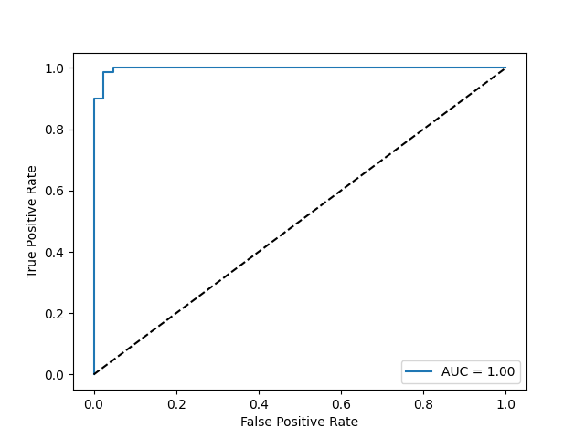
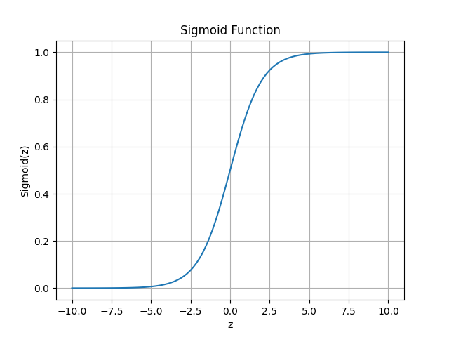

# BreastCancer-LogisticRegressionClassifier

## 📌 Description
This project implements a **binary classification model** using **Logistic Regression** to predict whether a tumor is malignant or benign.  
The **Breast Cancer Wisconsin Dataset** from Scikit-learn is used.  
The model is evaluated using metrics like **Confusion Matrix, Precision, Recall, F1-Score, ROC Curve, and AUC**.  
The decision threshold is tuned, and the sigmoid function is explained visually.

---

## 🛠 Steps Followed
1. Loaded the Breast Cancer dataset from Scikit-learn.
2. Performed Train/Test split and standardized features.
3. Trained a Logistic Regression model.
4. Evaluated the model with Confusion Matrix, Precision, Recall, and F1-Score.
5. Plotted the ROC curve and calculated AUC score.
6. Tuned the classification threshold.
7. Plotted and explained the Sigmoid function.

---

## 📸 Screenshots
Here are some outputs from the project:

  
  
  

---

## 👩‍💻 Author
**sudha tanmai**

---

✨ *Thank you for checking out my project! Keep learning and coding happily.* 😊

